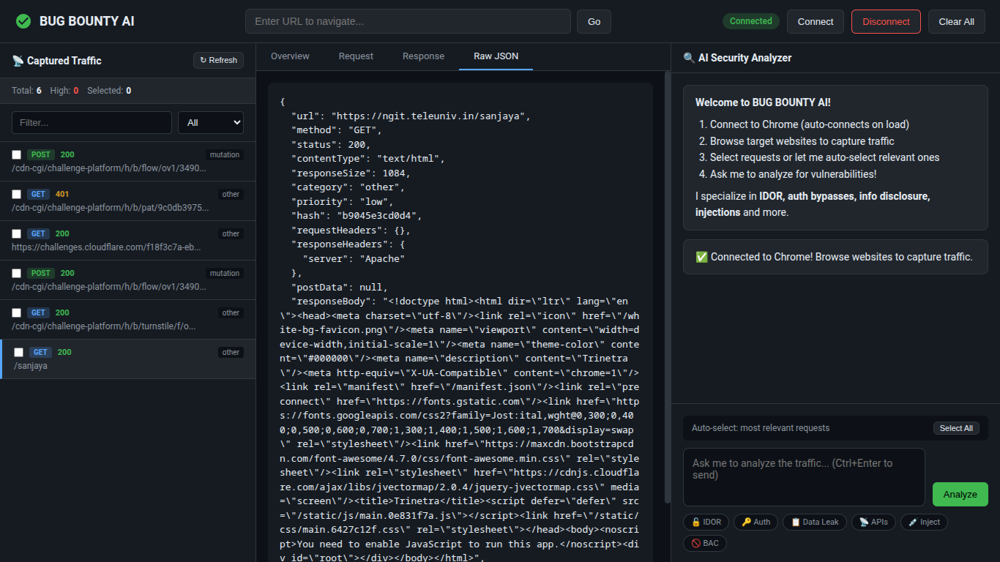
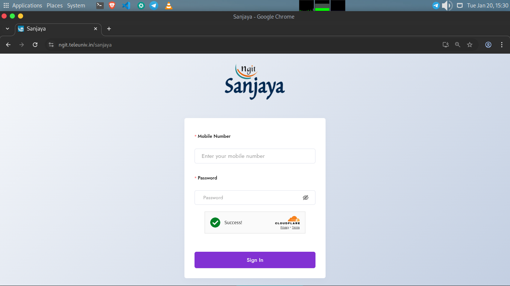

# Bug Bounty with AI 

A tool that combines a  Chromium browser (Puppeteer) with an AI brain (Mistral) to assist in bug bounty hunting.




## Features

- **Real Browser**: Uses Puppeteer to browse and capture traffic.
- **Traffic Capture**: Intercepts and saves API calls to JSON files in `captured/`.
- **Filtering**: Automatically ignores static assets (images, CSS, JS) and trackers.
- **AI Analysis**: Uses Mistral AI to analyze captured traffic and suggest vulnerabilities.
- **Context Optimization**: Truncates large responses to save AI context window.
- **GUI**: Simple web interface to control the browser and chat with the AI.

## Setup

1.  clone & Install dependencies:
    ```bash
    git clone https://github.com/localhost969/bounty.git
    cd bounty
    npm install
    ```

2.  Configure environment variables:
    - Add your Mistral API Key to `.env`:
      ```
      MISTRAL_API_KEY=your_key_here
      ```

3.  Run the server:
    ```bash
    npm start
    ```

4.  Open your browser and go to `http://localhost:3000`.

## Usage

1.  **Launch Browser**: Click "Launch Browser" in the GUI. A Chromium window will open.
2.  **Navigate**: Enter a URL and click "Navigate" or use the browser window directly.
3.  **Capture**: Traffic is automatically captured and saved to the `captured/` folder.
4.  **Analyze**: Select interesting files in the GUI list and ask the AI to analyze them (e.g., "Check for IDOR in these requests").
5.  **Execute**: If the AI suggests a curl command, you can run it in your terminal.

## Structure

```
/bounty
├── captured
├── nodemon.json
├── package.json
├── public
├── README.md
├── src
└── user_data
```

- `src/`: Source code (server, browser, AI, utils).
- `public/`: Frontend assets.
- `captured/`: Storage for captured traffic.
- `user_data/`: User-specific data (cookies and other data).
